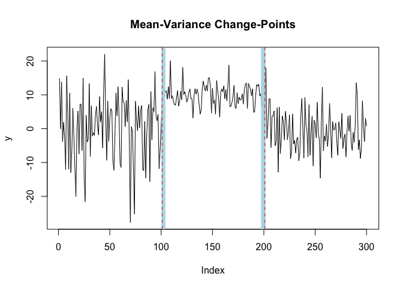

<!-- README.md is generated from README.Rmd. Please edit that file -->

# `{mich}` <a href="https://davis-berlind.github.io/mich/"></a>

## Fast Bayesian Inference for Change-Point Detection

<!-- badges: start -->
<!-- badges: end -->

`{mich}` is an R package that implements the Multiple Independent
Change-Point (MICH) method introduced in [Berlind, Cappello, Madrid
Padilla (2025)](https://arxiv.org/abs/2507.01558). The package’s main
function `mich()` implements a backfitting procedure to identify changes
in the mean and/or variance of a length $T$ sequence of observations
$\mathbf{y}_{1:T}$. The `mich.fit` object returned by `mich()` provides
a variational approximation to the posterior distribution of the
change-points.

## Installation

The development version of `{mich}` can be installed from GitHub using:

``` r
# install.packages("devtools")
devtools::install_github("davis-berlind/mich")
```

## Basic Usage

For an in-depth introduction check out [Getting
Started](articles/mich.html). The function `mich()` works by taking a
vector or matrix of observations `y` and integers `L`, `K`, and `J` that
specify the respective numbers of mean, variance, and joint mean and
variance change-points in `y`. In the example below we sample a series
with two changes in the mean and variance at times `101` and `201`.

``` r
library(mich)
set.seed(222)
# generate univariate data with two mean-variance change-points
y = c(rnorm(100,0,10), rnorm(100,10,3), rnorm(100,0,6))
# fit two mean-variance change-points
fit = mich(y, J = 2) 
summary(fit, level = 0.95)
#> Multivariate MICH Model:
#> 
#> ELBO: -227.315037808182; Converged: TRUE
#> 
#> J = 2 MeanVar-SCP Component(s); 2 Detected Mean-Variance Change-Point(s):
#>   change.points lower.0.95.credible.set upper.0.95.credible.set
#> 1           101                     101                     103
#> 2           201                     198                     201
```

Plotting the estimated change-points and their 95% credible sets shows
that `mich()` properly recovers the changes.

``` r
plot(fit, cs = TRUE, level = 0.95)
```


