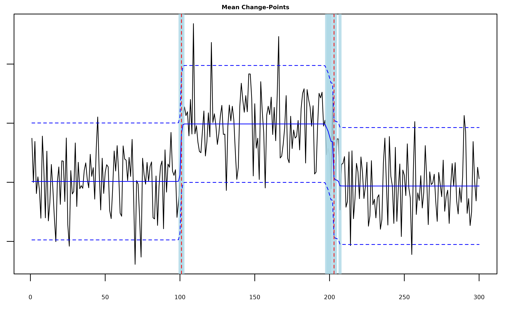
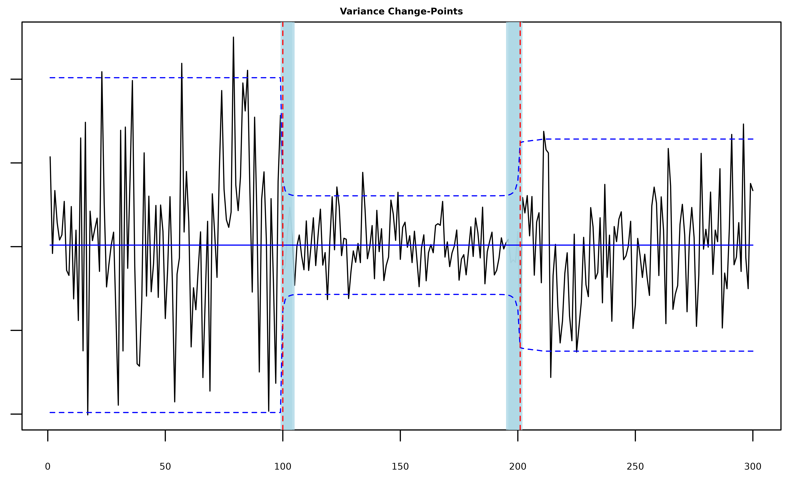
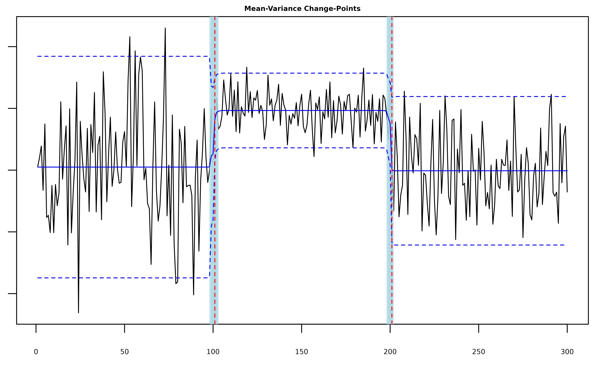
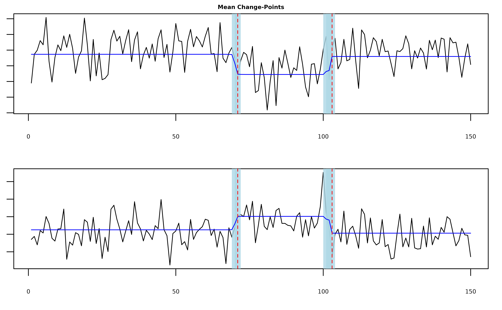
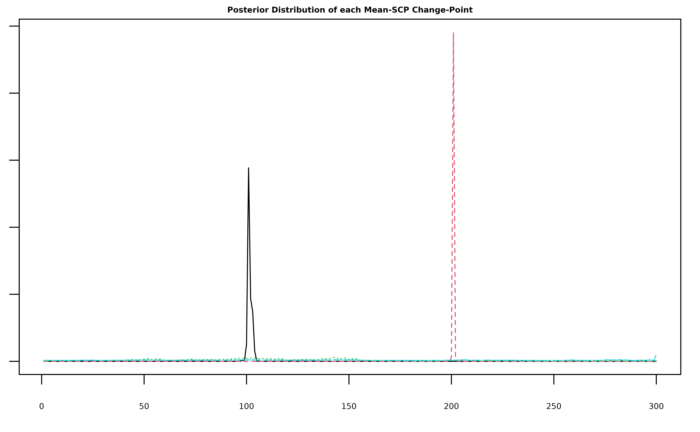

# Introduction to mich

``` r
set.seed(222)
library(mich)
```

## Basic Usage

The main function of the package is
[`mich()`](https://davis-berlind.github.io/mich/reference/mich.md),
which takes a vector or matrix of observations `y` and returns a
`mich.fit` object containing a variational approximation to the
posterior distribution of the change-points in the mean and/or variance
of `y`. The integer valued parameters `L`, `K`, and `J` specify the
respective numbers of mean, variance, and joint mean and variance
change-points in `y`. In each of the examples below, we sample a series
with two changes in the mean and/or variance at times `101` and `201`
and use
[`mich()`](https://davis-berlind.github.io/mich/reference/mich.md) to
estimate and construct 95% credible sets around the locations of the
changes.

### Mean Changes

``` r
# generate univariate data with two mean change-points
y = c(rnorm(100,0), rnorm(100,2), rnorm(100,0))
# fit two mean-scp components
fit = mich(y, L = 2) 
summary(fit, level = 0.95)
#> Univariate MICH Model:
#> 
#> ELBO: -242.324141949562; Converged: TRUE
#> 
#> L = 2 Mean-SCP Component(s); 2 Detected Mean Change-Point(s):
#>   change.points lower.0.95.credible.set upper.0.95.credible.set
#> 1           101                     100                     102
#> 2           203                     198                     207
```

The summary output shows us the ELBO for the fitted model as well as the
estimated locations of the changes and the lower and upper bounds of the
`level`-level credible sets around each change. Because we called
[`mich()`](https://davis-berlind.github.io/mich/reference/mich.md) with
`L > 0`, the returned `mich.fit` object contains a named list
`mean_model` that contains the posterior parameters for each of the `L`
components in the model. The most important element is `pi_bar`, which
is a T x L matrix of posterior change-point location probabilities (for
a detailed description of each element of `mean_model`, type
[`?mich`](https://davis-berlind.github.io/mich/reference/mich.md) in the
console). We can use `pi_bar` along with the function
[`mich_sets()`](https://davis-berlind.github.io/mich/reference/mich_sets.md)
to construct change-point estimates and credible sets.

``` r
# MAP estimates with 95% credible sets
mich_sets(fit$mean_model$pi_bar, level = 0.95)
#> $cp
#> [1] 101 203
#> 
#> $sets
#> $sets[[1]]
#> [1] 100 101 102
#> 
#> $sets[[2]]
#> [1] 198 199 200 201 203 204 207
```

The [`plot()`](https://rdrr.io/r/graphics/plot.default.html) function is
extended to the `mich.fit` class and uses
[`mich_sets()`](https://davis-berlind.github.io/mich/reference/mich_sets.md)
to plot the returned MAP estimates as well as the estimated signal if
`signal == TRUE` and credible sets if `cs == TRUE` (note that as in the
plot below, these truly are sets, not intervals).

``` r
plot(fit, cs = TRUE, level = 0.95, signal = TRUE)
```



### Variance Changes

``` r
# generate univariate data with two variance change-points
y = c(rnorm(100,0,10), rnorm(100,0,3), rnorm(100,0,6))
# fit two var-scp components
fit = mich(y, K = 2) 
summary(fit, level = 0.95)
#> Univariate MICH Model:
#> 
#> ELBO: -362.67485155576; Converged: TRUE
#> 
#> K = 2 Var-SCP Component(s); 2 Detected Variance Change-Point(s):
#>   change.points lower.0.95.credible.set upper.0.95.credible.set
#> 1           100                     100                     104
#> 2           201                     196                     201
```

The posterior quantities are now stored in `fit$var_model$pi_bar`.

``` r
plot(fit, cs = TRUE, level = 0.95, signal = TRUE)
```



### Mean-Variance Changes

``` r
# generate univariate data with two mean-variance change-points
y = c(rnorm(100,0,10), rnorm(100,10,3), rnorm(100,0,6))
# fit two meanvar-scp components
fit = mich(y, J = 2) 
summary(fit, level = 0.95)
#> Univariate MICH Model:
#> 
#> ELBO: -220.537132456086; Converged: TRUE
#> 
#> J = 2 MeanVar-SCP Component(s); 2 Detected Mean-Variance Change-Point(s):
#>   change.points lower.0.95.credible.set upper.0.95.credible.set
#> 1           101                      99                     102
#> 2           201                     199                     201
```

The posterior quantities are now stored in `fit$meanvar_model$pi_bar`.

``` r
plot(fit, cs = TRUE, level = 0.95, signal = TRUE)
```



### Multiple Change-Types

Note that by default `L=K=J=0`, so the call `mich(y)` will fit the null
model assuming no changes are present in the mean or variance of `y`. It
is also possible to fit
[`mich()`](https://davis-berlind.github.io/mich/reference/mich.md) with
multiple kinds of changes, e.g. we could rerun the last example with one
of the changes misspecified as just a mean change.

``` r
# generate univariate data with two mean-variance change-points
y = c(rnorm(100,0,10), rnorm(100,10,3), rnorm(100,0,6))
# fit one mean-scp component and meanvar-scp component
fit = mich(y, L=1, J = 1) 
summary(fit, level = 0.95)
#> Univariate MICH Model:
#> 
#> ELBO: -254.723737904751; Converged: TRUE
#> 
#> L = 1 Mean-SCP Component(s); 1 Detected Mean Change-Point(s):
#>   change.points lower.0.95.credible.set upper.0.95.credible.set
#> 1           101                      86                     103
#> 
#> J = 1 MeanVar-SCP Component(s); 1 Detected Mean-Variance Change-Point(s):
#>   change.points lower.0.95.credible.set upper.0.95.credible.set
#> 1           200                     199                     202
```

We see that the model uses the mean-component to fit the first change
and the mean-variance component to fit the second change.

``` r
plot(fit, cs = TRUE, level = 0.95)
```


### Multivariate Mean Changes

In the case where `y` is a T x d matrix,
[`mich()`](https://davis-berlind.github.io/mich/reference/mich.md) can
detect mean changes that are shared across all or some of the columns.
The columns of `y` do not need to be independent and by default
[`mich()`](https://davis-berlind.github.io/mich/reference/mich.md) will
attempt to estimate the precision matrix of the series (see the
discussion of the `fit_scale` parameter below). In the following example
`y[,1]` and `y[,2]` are positively correlated.

``` r
T <- 150
d <- 2

# covariance matrix
Sigma <- rbind(c(1, 0.7), c(0.7, 2))
Sigma_eigen <- eigen(Sigma)
e_vectors <- Sigma_eigen$vectors
e_values <- Sigma_eigen$values
Sigma_sd <- e_vectors %*% diag(sqrt(e_values)) %*% t(e_vectors)

# construct mean signal
mu <- c(-1, 2)
mu_t <- matrix(0, nrow = 70, ncol = d)
mu_t <- rbind(mu_t, t(sapply(1:30, function(i) mu)))
mu_t <- rbind(mu_t, matrix(0, nrow = 50, ncol = d))

# generate data
Z <- sapply(1:d, function(i) rnorm(T))
Y <- mu_t + Z %*% Sigma_sd

# fit two multivariate mean-scp components
fit = mich(Y, L = 2)
```

``` r
plot(fit, cs = TRUE, level = 0.95, signal = TRUE)
```



## Selecting `L`, `K`, and `J`

In the previous section we treated the numbers of each kind of
change-point as known quantities, but more often than not we need to
estimate these parameters. One option is to set `L`, `K`, and `J` equal
to some large numbers that upper bound each kind of change. For example
if we think there are at most five mean changes in the data then we can
set `L = 5`.

``` r
# generate univariate data with two mean change-points
y = c(rnorm(100,0), rnorm(100,2), rnorm(100,0))
# fit five mean-scp components
fit = mich(y, L = 5) 
summary(fit, level = 0.95)
#> Univariate MICH Model:
#> 
#> ELBO: -226.57173121568; Converged: TRUE
#> 
#> L = 5 Mean-SCP Component(s); 2 Detected Mean Change-Point(s):
#>   change.points lower.0.95.credible.set upper.0.95.credible.set
#> 1           101                     100                     103
#> 2           201                     201                     201
```

``` r
plot(fit, cs = TRUE, level = 0.95)
```


Note that the model still only detected the two true change-points. The
plot below shows that this is because the extra three components we
included have very diffuse posterior distributions that do not satisfy
the detection criterion of having credible sets containing fewer than
`log(T)^2` indices (see Corollary 1 of [Berlind, Cappello, and Madrid
Padilla (2025)](https://arxiv.org/abs/2507.01558)).



### Auto-MICH

Alternatively, we can use the ELBO as an approximation to marginal
likelihood of the model and automatically select the `L`, `K`, and `J`
that maximizes the ELBO. This option is implemented in
[`mich()`](https://davis-berlind.github.io/mich/reference/mich.md) via
the `L_auto`, `K_auto`, and `J_auto` parameters. If `L_auto == TRUE`,
then [`mich()`](https://davis-berlind.github.io/mich/reference/mich.md)
searches for the number of mean changes between `L` and `L_max` that
maximize the EBLO.

``` r
# fit mich with L selected automatically
fit = mich(y, L_auto = TRUE, verbose = TRUE, restart = FALSE) 
#> [1] "(L = 0, K = 0, J = 0): ELBO = -304.942450777234; Counter: 6"
#> [1] "(L = 1, K = 0, J = 0): ELBO = -298.331456279221; Counter: 6"
#> [1] "(L = 2, K = 0, J = 0): ELBO = -211.047722355175; Counter: 6"
#> [1] "(L = 3, K = 0, J = 0): ELBO = -215.885482079647; Counter: 6"
#> [1] "(L = 4, K = 0, J = 0): ELBO = -220.962514999129; Counter: 5"
#> [1] "(L = 5, K = 0, J = 0): ELBO = -226.200102703732; Counter: 4"
#> [1] "(L = 6, K = 0, J = 0): ELBO = -231.558781723112; Counter: 3"
#> [1] "(L = 7, K = 0, J = 0): ELBO = -237.01160903598; Counter: 2"
#> [1] "(L = 8, K = 0, J = 0): ELBO = -242.541140918896; Counter: 1"
#> [1] "(L = 9, K = 0, J = 0): ELBO = -248.136597702824; Counter: 0"
#> [1] "Merging. Merge Counter: 1"
summary(fit, level = 0.95)
#> Univariate MICH Model:
#> 
#> ELBO: -211.048798898986; Converged: TRUE
#> 
#> L = 2 Mean-SCP Component(s); 2 Detected Mean Change-Point(s):
#>   change.points lower.0.95.credible.set upper.0.95.credible.set
#> 1           101                     100                     103
#> 2           201                     201                     201
```

Once again
[`mich()`](https://davis-berlind.github.io/mich/reference/mich.md) is
able to correctly identify the mean-changes, but now setting
`L_auto == TRUE` results in a model with only two components.

``` r
plot(fit, cs = TRUE, level = 0.95)
```


Similarly, if `K_auto == TRUE` or `J_auto == TRUE` then
[`mich()`](https://davis-berlind.github.io/mich/reference/mich.md)
searches for the optimal number of variance and mean-variance components
to include in the model. It is possible to have some combination of
`L_auto`, `K_auto`, and/or `J_auto` set equal to true, in which case
[`mich()`](https://davis-berlind.github.io/mich/reference/mich.md) takes
turns incrementing `L`, `K`, and `J` and moves in the direction that
results in the largest increase in the ELBO.

``` r
# fit mich with L selected automatically
fit = mich(y, L_auto = TRUE, J_auto = TRUE, verbose = TRUE, restart = FALSE) 
#> [1] "(L = 0, K = 0, J = 0): ELBO = -304.942450777234"
#> [1] "(L = 0, K = 0, J = 1): ELBO = -290.56141335325"
#> [1] "(L = 1, K = 0, J = 0): ELBO = -298.331456279221"
#> [1] "(L = 0, K = 0, J = 2): ELBO = -226.747670431813"
#> [1] "(L = 1, K = 0, J = 1): ELBO = -308.614869844839"
#> [1] "(L = 0, K = 0, J = 3): ELBO = -235.207021249792"
#> [1] "(L = 1, K = 0, J = 2): ELBO = -232.203193790049"
#> [1] "(L = 1, K = 0, J = 3): ELBO = -247.407027549628"
#> [1] "(L = 2, K = 0, J = 2): ELBO = -232.674862962079"
#> [1] "(L = 2, K = 0, J = 3): ELBO = -247.141610997682"
#> [1] "(L = 3, K = 0, J = 2): ELBO = -238.433249627662"
#> [1] "(L = 3, K = 0, J = 3): ELBO = -250.526457976407"
#> [1] "(L = 4, K = 0, J = 2): ELBO = -243.104705526494"
#> [1] "(L = 4, K = 0, J = 3): ELBO = -257.781771835369"
#> [1] "(L = 5, K = 0, J = 2): ELBO = -248.914056107144"
#> [1] "(L = 5, K = 0, J = 3): ELBO = -264.495764094318"
#> [1] "(L = 6, K = 0, J = 2): ELBO = -254.768484151035"
summary(fit, level = 0.95)
#> Univariate MICH Model:
#> 
#> ELBO: -226.747670431813; Converged: TRUE
#> 
#> J = 2 MeanVar-SCP Component(s); 2 Detected Mean-Variance Change-Point(s):
#>   change.points lower.0.95.credible.set upper.0.95.credible.set
#> 1           101                     100                     103
#> 2           201                     201                     201
```

``` r
plot(fit, cs = TRUE, level = 0.95)
```


Lastly,
[`mich()`](https://davis-berlind.github.io/mich/reference/mich.md)
accepts the integer valued parameter `increment`, which determines how
many components are added to the model as
[`mich()`](https://davis-berlind.github.io/mich/reference/mich.md)
searches for the best `L`, `K`, and/or `J`, and `restart`, which causes
[`mich()`](https://davis-berlind.github.io/mich/reference/mich.md) to
refit the model from a null parameterization once the ELBO stops
increasing, which can help the variational algorithm escape local
minima.

## Priors

### Prior Change-Point Location Probabilities

The priors for the change-point locations are controlled by the `pi_l`,
`pi_k`, and `pi_j` parameters (each corresponding the the prior
locations of mean, variance, and mean and variance changes). By default
these parameters are set equal to `"weighted"`, in which case the
functions
[`log_mean_prior()`](https://davis-berlind.github.io/mich/reference/log_mean_prior.md),
[`log_var_prior()`](https://davis-berlind.github.io/mich/reference/log_var_prior.md),
and
[`log_meanvar_prior()`](https://davis-berlind.github.io/mich/reference/log_meanvar_prior.md)
are used to calculated weighted priors that ensure diffuse posterior
distributions in the absence of any changes in the mean and/or variance
of `y` (see Appendix C.2 of [Berlind, Cappello, and Madrid Padilla
(2025)](https://arxiv.org/abs/2507.01558) for a detailed discussion).
Setting `pi_l`, `pi_k`, or `pi_j` equal to `"uniform"` will force
[`mich()`](https://davis-berlind.github.io/mich/reference/mich.md) to
use the uniform prior `rep(1/T, T)` instead. The user can also provide
their own priors by setting `pi_l`, `pi_k`, or `pi_j` equal to a vector
`pi` such that `length(pi) == length(y)` and `sum(pi) == 1`, in which
case `pi` will be used as the prior for all of the model components.
`pi` can also be a matrix of probabilities so long as
`nrow(pi) == length(y)`, `all(colSums(pi) == 1) == TRUE`, and if
`pi_l = pi` then `ncol(pi) == L` and so on for `pi_k` and `pi_j`.

### Precision, Shape, and Rate Parameters

Each of the prior precision, shape, and rate parameters in the model is
set equal to `0.001` by default. The user can change these parameters by
modifying `omega_l, u_k, v_k, omega_j, u_j` and `v_j`, but the
sensitivity analysis in [Berlind, Cappello, and Madrid Padilla
(2025)](https://arxiv.org/abs/2507.01558) indicates that as long as
these values are small, they do not meaningfully alter the output of
[`mich()`](https://davis-berlind.github.io/mich/reference/mich.md).

## Standardization

When `standardize == TRUE`,
[`mich()`](https://davis-berlind.github.io/mich/reference/mich.md) will
center and rescale the data before running the main variational
algorithm. While this step can help improve performance, because the
location of the first change-point is unknown, it does not guarantee
that `y` will begin centered at zero or have unit variance. Instead,
[`mich()`](https://davis-berlind.github.io/mich/reference/mich.md)
estimates and returns an intercept `mu_0` and initial precision
`lambda_0` by default (when `y` is a matrix, the estimated
variance-covariance matrix is returned instead as `Sigma`). If `y` is
known to be centered at zero or have unit variance, than the estimation
of these parameters can be avoided by setting `fit_intecept == FALSE`
and/or `fit_scale == FALSE`.

## Additonal Parameters

Additional control parameters can be viewed by typing
[`?mich`](https://davis-berlind.github.io/mich/reference/mich.md) in the
console. These include the convergence criterion `tol`, a `verbose`
parameter that will prompt
[`mich()`](https://davis-berlind.github.io/mich/reference/mich.md) to
provide feedback as it fits the model, and a `reverse` parameter that
will make
[`mich()`](https://davis-berlind.github.io/mich/reference/mich.md) fit
to `y[T:1]` in place of `y` which can occasionally improve the model
fit.
