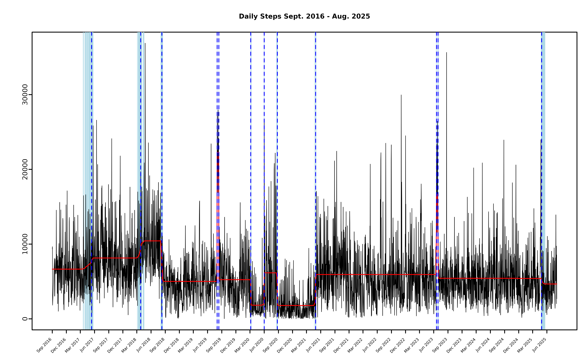

# Detecting Changes in Daily Step Count

Due to the widespread adoption of wearable devices over the past decade,
individuals now have unprecedented access to high-frequency personal
health data. A [2023 NIH
survey](https://www.nhlbi.nih.gov/news/2023/study-reveals-wearable-device-trends-among-us-adults)
revealed that “one in three Americans uses a wearable device, such as a
smart watch or band, to track their health and fitness.” The data
collected from these devices can be used to detect changes in a person’s
health or lifestyle. I don’t personally own any wearable devices, but
for nearly a decade I have used my phone to record the steps I take in a
given day. This data is bundled with the
[mich](https://davis-berlind.github.io/mich/) package as the
`daily_steps` data set. Below I show how I used `mich` to detect the
changes in my life that manifest in `daily_steps`. In [Berlind,
Cappello, and Madrid Padilla (2025)](https://arxiv.org/abs/2507.01558),
we showed how to extend the MICH model to count data, but seeing as this
feature is not yet implemented in the
[mich](https://davis-berlind.github.io/mich/) package, I instead model
the change-points as joint changes to the mean and variance of
`daily_steps$total_steps` and set `J_auto == TRUE` to automatically
select the number of mean-variance components to include in the model.

``` r
library(mich)
daily_steps$day <- as.Date(daily_steps$day)

step_fit <- mich(daily_steps$total_steps, J_auto = TRUE, tol = 1e-10,
                 max_iter = Inf, restart = FALSE)
```



After fitting
[`mich()`](https://davis-berlind.github.io/mich/reference/mich.md) to
the step data, we see that there are 12 changes detected, each of which
is annotated in the table below:

| Estimated Change   | 90% CS Size | Annotation                                                                                                                                                                                      |
|:-------------------|------------:|:------------------------------------------------------------------------------------------------------------------------------------------------------------------------------------------------|
| May 24, 2017       |          47 | I lived in NYC from 2016 to 2018 and walked much more during the summer. This change-point appears to be this seasonal change (note the wide 90% credible set that extends from March to June). |
| April 06, 2018     |          34 | Again, this change seems to be the switch from winter to summer (note that MICH apparently misses the seasonal decrease in the winter of 2017).                                                 |
| August 21, 2018    |          12 | I moved from NYC to Durham, NC at the beginning of August 2018, to begin a masters degree program at Duke (orientation was August 21, 2018).                                                    |
| August 21, 2018    |          12 | I moved from NYC to Durham, NC at the beginning of August 2018, to begin a masters degree program at Duke (orientation was August 21, 2018).                                                    |
| August 13, 2019    |           1 | From 8-12-2019 to 8-24-2019 I traveled to Ireland and Scotland with my now wife.                                                                                                                |
| August 24, 2019    |           1 | Return from Ireland/Scotland.                                                                                                                                                                   |
| March 17, 2020     |           4 | On 3-17-2020 I flew to Miami to spend the first phase of lock-down with my wife and her family.                                                                                                 |
| June 12, 2020      |           2 | On 6-11-2020 I moved to Boston.                                                                                                                                                                 |
| September 05, 2020 |           5 | On 9-2-2020 I began a PhD in economics at BU.                                                                                                                                                   |
| May 10, 2021       |           7 | On 5-8-2021 I took my last exam at BU and left the program to transfer to the Department of Statistics at UCLA.                                                                                 |
| June 30, 2023      |           3 | From 6-29-2023 to 7-13-2023 I traveled to Prague, Vienna, and Greece for a friend’s wedding.                                                                                                    |
| July 10, 2023      |           5 | Returned from Greece.                                                                                                                                                                           |
| May 09, 2025       |          27 | This change captures the fact that in May I hunkered down and barely left my desk in order to get the preprint of my paper up on arXiv 💀.                                                      |
